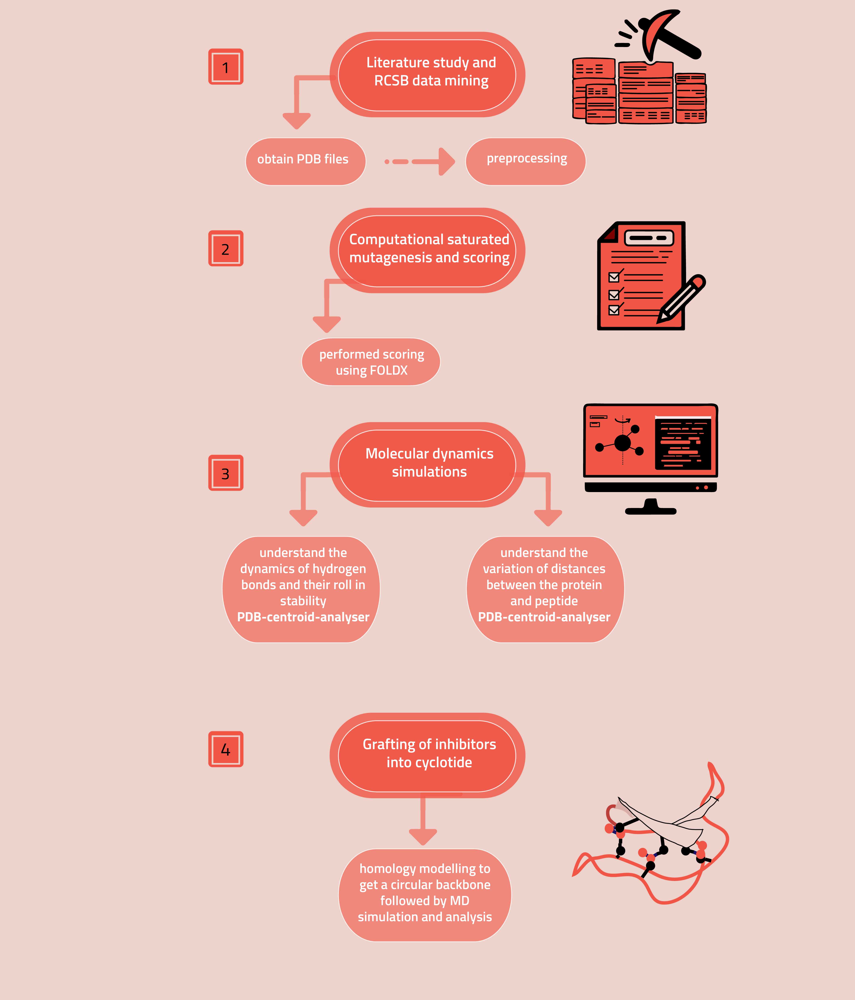
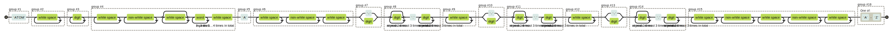

# Overview




# Analysis of Molecular Dynamics simulations

To analyse the MD simulaions of a Protein and its peptide inhibitor, we wanted to understand two particular aspects in greater detail: 
## How does the distance between the centroids of the Protein and peptide evolve over time ? 
  1. If it increasing, it means that over-time the peptide flies away from the protein and is not binding effectively.
  2. If the distance between the centroid of the two entities remains constant, then over the duration of the simulation, the peptide binds strongly to the protein and can act as a good inhibitor. 
  3. If the distance decreases, then the peptide moves closer to the Protein core. (However, this is assumed to be unlikely) 
  
To perform these calculations, I wrote the script PDB_centroid_analyser. 
 
### What does PDB_centroid_analyser do ?

```PDB_centroid_analyser.py``` basically reads through a .pdb file and captures all lines containing "ATOM .... \<element name\>". This is performed using Python regular expressions. The railroad diagram of the regex code is as follows: 
  
Regex Railroad diagram : 



Here : 
 - Atom no -->  group(1)
 - Chain name --> group(3)
 - X co-ordinates --> group(5)+group(6)
 - Y co-ordinates --> group(8)+group(9)
 - Z co-ordinates --> group(11)+group(12)
 - Atom -->  group(14)

After reading these lines, the function get_centroid() obtains the centroid (x,y,z) of a given chain. We perform calculations in numpy arrays using the standard centroid formula: 

   **Centroid = sum( w[i] * r[i] ) / sum(w[i])** 
  
A wrapper function, **main()** calls other multiple functions to determine the distance between the centroid of two chains using euclidean_distance(). This is done for all the .pdb files submitted in the text file. *Special care* has to be taken to ensure that all .pdb files are in the official presribed format, otherwise the regex syntax will not be able to identify the chain, atom or element. Finally the script writes a .csv file in the same directory which includes the following fields:

1. File name 
2. Centroid of Chain1 "{chain-name given}"
3. Centroid of Chain2 "{chain-name is user-input}"
4. Distance between the centroids

--> This .csv file serves as a good checkpoint for performing further analysis. 

The script can be run on the command line/terminal and also imported into other scripts if particular functions seem interesting. The command line version takes two arguments:
1. A text file containing all .pdb names 
2. The output .csv filename.

The other functions included in PDB_centroid_analyser are : 
1. get_centorid() --> returns the centroid of a particular chain from a .pdb file
2. euclidean_distance() --> returns the distance between two vectors
3. pdb_names2list() --> returns a list from a text file containing names (one name in each line)
4. pdb_list_centroid2df() --> returns a .csv file containing centroid and distance information

## Hydrogen Bond Analysis

To understand effective binding, we analyse the number of intermolecular Hydrogen bonds between the Protein and the peptide. This entails the analysis of hbonds over each snapshot of the MD simulation to determine which residues and specifically which atom in these residues of the peptide inhibitor form hydrogen bonds with the protein. We also aim to determine the relative abundance of Hydrogen bonds formed over the entire simulation period. 

To perform these calculations, I wrote a script that functions on top of [Chimera](https://www.cgl.ucsf.edu/chimera/).  


### Computing the Hydrogen Bond Profile

#### Objective :
- Given a .pdb file, we use ```Hbond-analyzer.sh``` along with the ```hbond-script.cmd``` to obtain a ```{}_hbond_info.txt``` file. This contains information about the hydrogen bonds in the given .pdb file. We do this for multiple .pdb files
- The python script ```PDB_Hbond_analyser.py ``` reads through multiple ```{}_hbond_info.txt``` files and returns a .csv file with a structured dataframe format that can be used for further analysis. 


##### ```Hbond-analyzer.sh```
The bash script hbond-analyzer is a wrapper-script containing functions built over Chimera and uses the --nogui flag to run it without the graphical user interface.

The Script takes two arguments : 
1. A text file containing .pdb files that are to be analysed (must be in the same directory as the script and .pdb files)
2. A .cmd file containing chimera commands

**Note** : It is assumed that the chimera executable file is stored at ```~/chimera/bin/chimera```. If not the path to the executable has to be specified in line 11 

The commands to be run in chimera is submitted in a .cmd file, with each line containing the command based on chimera documentation. 

##### Working

The script loops over each line of the text line (basically a file name), reads that particular file and processes it based on the instructions given in the .cmd file. After processing, the last 8 lines of the output (required information is stored here) is written to an external file. We then use the Linux stream editor ('sed') to replace the filename to be read next in the .cmd file and a similar process continues untill all files in the .txt file are processed.   


##### ```PDB_Hbond_analyser.py ```

The script takes two arguments : 
1. A text file  containing the names of ```._hbond_info.txt files``` (outputs of ```Hbond-analyzer.sh```) that are to be analysed (must be in the same directory as the script and .txt files)
2. The name of the output .csv file where the output data is written 

##### Working 
The python script contains a host of preprocessing functions that read data from the output files of ```Hbond-analyzer.sh``` ie files ending with ```hbond_info.txt```. The script processes each line in the .txt file using grep expressions and returns a dataframe containing information on the Hydrogen bonds (Donor atom, Acceptor atom, Donor-Hydrogen, Distance D-A, Distance D-H-A, No of Hydrogen bonds). This is used for further Data Analysis and Interpretation
